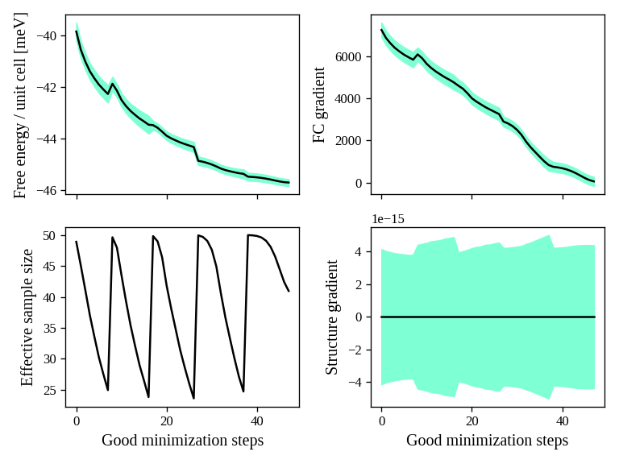
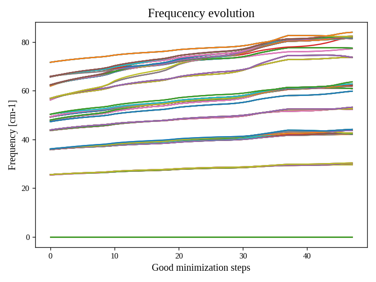

Calculations of second-order phase transitions with the SSCHA
=============================================================

In this chapter we provide ready to use examples to calculate second-order phase transitions with SSCHA calculations.

Structural instability: calculation of the Hessian
--------------------------------------------------

This tutorial explains how to search for structural instabilities with a SSCHA calculation.

The SSCHA method provides a complete theoretical framework to study second-order phase transitions for structural instabilities.

According to Landau’s theory of second-order phase transitions, a phase transition occurs when the free energy curvature around the high-symmetry structure on the direction of the order parameter becomes negative:
[image]

For structural phase transitions, the order parameter is associated to phonon atomic displacements $$\frac{\partial^2 F}{\partial R_a \partial R_b}$$. So we just need to calculate the Free energy Hessian. the SSCHA provides an analytical equation for the free energy Hessian, derived by Raffaello Bianco in the work Bianco et. al. Phys. Rev. B 96, 014111 <https://journals.aps.org/prb/abstract/10.1103/PhysRevB.96.014111>.
The free energy curvature can be written in matrix form as:

$$\frac{\partial^2 F}{\partial {R_a}\partial {R_b}} = \Phi_{ab} + \sum_{cdef} \stackrel{(3)}{\Phi}_{acd}[1 - \Lambda\stackrel{(4)}{\Phi}]^{-1}_{cdef} \stackrel{(3)}{\Phi}_{efb}$$

*****
Starting from the Gold structure in the primitive cell, to run the SSCHA we need:
 - Compute the harmonic phonons (dynamical matrix)
 - Remove imaginary frequencies (if any)
 - Run the SSCHA

We prepared an input file in the form of a python script (tested with python-sscha version 1.2) which makes all these passages automatically.

You find a copy of the script and the cif file of Gold inside the directory Examples/ThermodynamicsOfGold

.. code-block:: python

   # Import the sscha code
   import sscha, sscha.Ensemble, sscha.SchaMinimizer, sscha.Relax, sscha.Utilities

   # Import the cellconstructor library to manage phonons
   import cellconstructor as CC, cellconstructor.Phonons
   import cellconstructor.Structure, cellconstructor.calculators

   # Import the force field of Gold
   import ase, ase.calculators
   from ase.calculators.emt import EMT

   # Import numerical and general pourpouse libraries
   import numpy as np, matplotlib.pyplot as plt
   import sys, os

   """
   Here we load the primitive cell of Gold from a cif file.
   And we use CellConstructor to compute phonons from finite differences.
   The phonons are computed on a q-mesh 4x4x4
   """

   gold_structure = CC.Structure.Structure()
   gold_structure.read_generic_file("Au.cif")

   # Get the force field for gold
   calculator = EMT()

   # Relax the gold structure (useless since for symmetries it is already relaxed)
   relax = CC.calculators.Relax(gold_structure, calculator)
   gold_structure_relaxed = relax.static_relax()

   # Compute the harmonic phonons
   # NOTE: if the code is run with mpirun, the calculation goes in parallel
   gold_harmonic_dyn = CC.Phonons.compute_phonons_finite_displacements(gold_structure_relaxed, calculator, supercell = (4,4,4))

   # Impose the symmetries and
   # save the dynamical matrix in the quantum espresso format
   gold_harmonic_dyn.Symmetrize()
   gold_harmonic_dyn.save_qe("harmonic_dyn")

   # If the dynamical matrix has imaginary frequencies, remove them
   gold_harmonic_dyn.ForcePositiveDefinite()

   """
   gold_harmonic_dyn is ready to start the SSCHA calculation.

   Now let us initialize the ensemble, and the calculation at 300 K.
   We will run a NVT calculation, using 100 configurations at each step
   """

   TEMPERATURE = 300
   N_CONFIGS = 50
   MAX_ITERATIONS = 20

   # Initialize the random ionic ensemble
   ensemble = sscha.Ensemble.Ensemble(gold_harmonic_dyn, TEMPERATURE)

   # Initialize the free energy minimizer
   minim = sscha.SchaMinimizer.SSCHA_Minimizer(ensemble)
   minim.set_minimization_step(0.01)

   # Initialize the NVT simulation
   relax = sscha.Relax.SSCHA(minim, calculator, N_configs = N_CONFIGS,
   max_pop = MAX_ITERATIONS)

   # Define the I/O operations
   # To save info about the free energy minimization after each step
   ioinfo = sscha.Utilities.IOInfo()
   ioinfo.SetupSaving("minim_info")
   relax.setup_custom_functions(custom_function_post = ioinfo.CFP_SaveAll)

   # Run the NVT simulation (save the stress to compute the pressure)
   relax.relax(get_stress = True)

   # If instead you want to run a NPT simulation, use
   # The target pressure is given in GPa.
   #relax.vc_relax(target_press = 0)

   # You can also run a mixed simulation (NVT) but with variable lattice parameters
   #relax.vc_relax(fix_volume = True)

   # Now we can save the final dynamical matrix
   # And print in stdout the info about the minimization
   relax.minim.finalize()
   relax.minim.dyn.save_qe("sscha_T{}_dyn".format(TEMPERATURE))

Now save the file as `sscha_gold.py` and execute it with:

.. code-block:: bash

   $ python sscha_gold.py > output.log

And that's it. The code will probably take few minutes on a standard laptop computer.
**Congratulations!** You run your first SSCHA simulation!

If you open a new terminal in the same directory of the SSCHA submission, you can plot the info during the minimization.
Starting from version 1.2, we provide a visualization utilities installed together with the SSCHA.
Simply type

.. code-block:: bash

   $ sscha-plot-data.py minim_info

You will see two windows.

.. _fig-goldminim:

   Minimization data of Gold.

In :numref:`fig-goldminim` we have all the minimization data. On the top-left panel, we see the free energy. As expected, it decreases (since the SSCHA is minimizing it).
You can see that at certain values of the steps there are discontinuities.
These occurs when the code realizes that the ensemble on which it is computing is no more good and a new one is generated. The goodness of an ensemble is determined by the Kong-Liu effective sample size (bottom-left).
When it reaches 0.5 of its initial value (equal to the number of configurations), the ensemble is extracted again and a new iteration starts. You see that in the last iteration, the code stops before getting to 25 (:math:`0.5\cdot 50`). This means that the code converged properly: the gradient reached zero when the ensemble was still good.

On the right-side you see the free energy gradients, which must go to zero to converge. The top-right is the gradient of the SSCHA dynamical matrix, while on bottom-right there is the gradient of the average atomic positions.

Indeed, since the gold atomic positions are all fixed by symmetries, it is always zero (but it will be different from zero in more complex system).

.. _fig-goldfreqs:

   All the SSCHA phonon frequencies as a function of the step in the NVT simulation.

Instead, :numref:`fig-goldfreqs` represents the evolution of the SSCHA phonon frequencies.
Here, all the frequencies in the supercell (at each q point commensurate with the calculation) are shown.

By looking at how they change you can have an idea on which phonon mode are more affected by anharmonicity. In this case, it is evident that Gold is trongly anharmonci and that the finite temperature tend to harden almost all the phonon frequencies.

At the end of the simulation, the code writes the final dynamical matrix in the quantum espresso file format: *sscha_T300_dynX* where X goes over the number of irreducible q points.

In the next section, we analyze in details each section of the script to provide a bit more insight on the simulation, and a guide to modify it to fit your needs and submit your own system.

Plot the phonon dispersion
--------------------------
